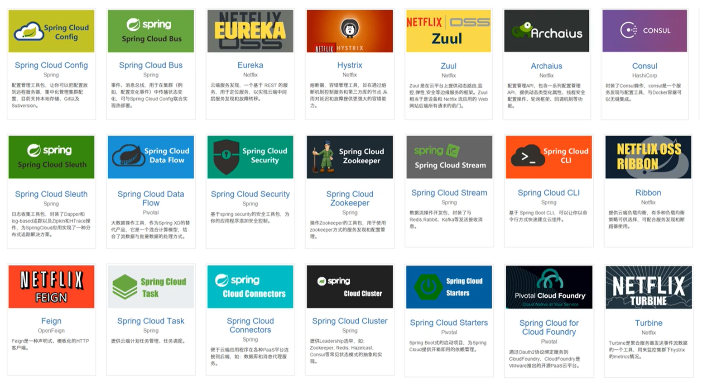
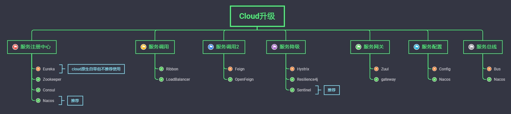
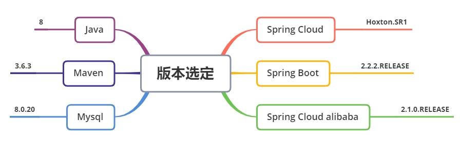
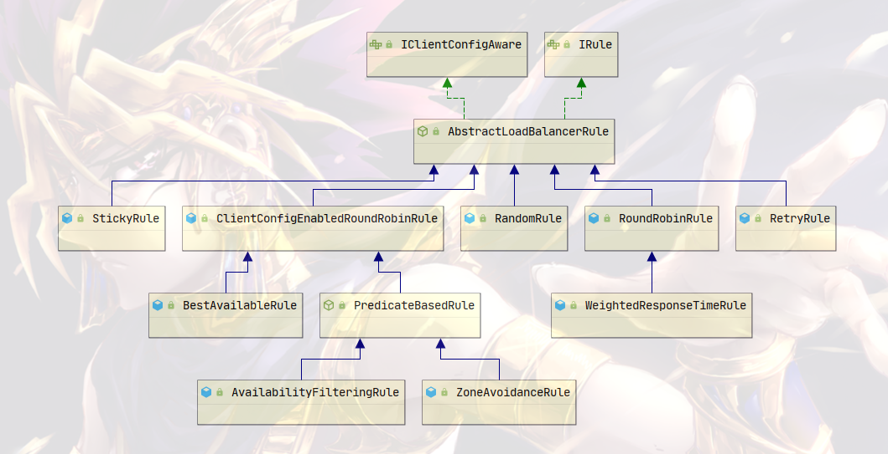
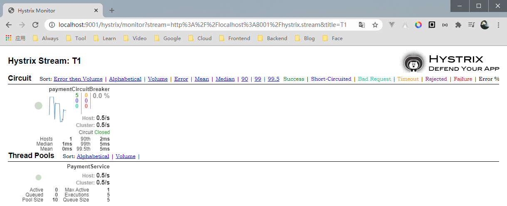
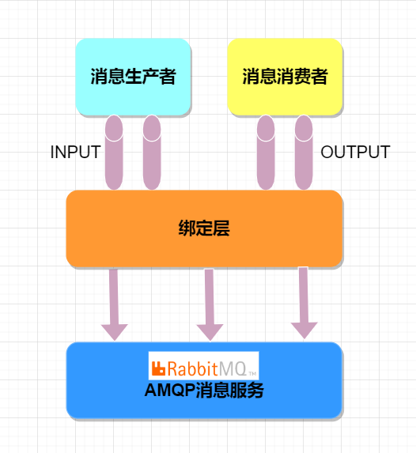
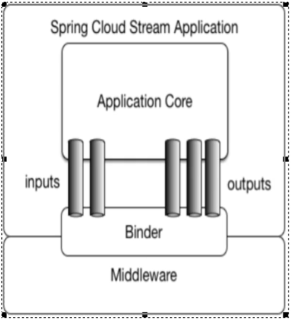
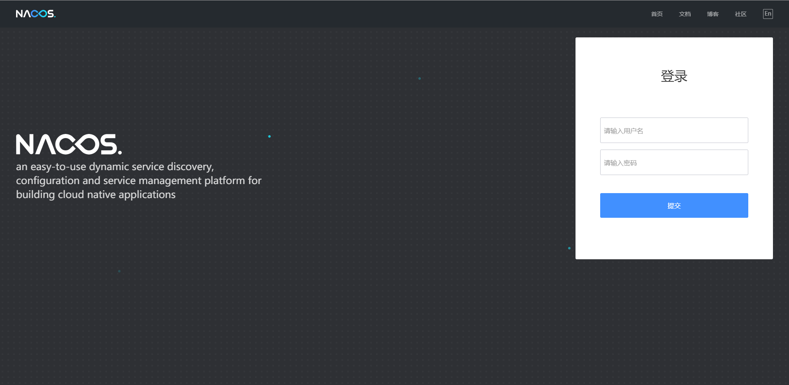
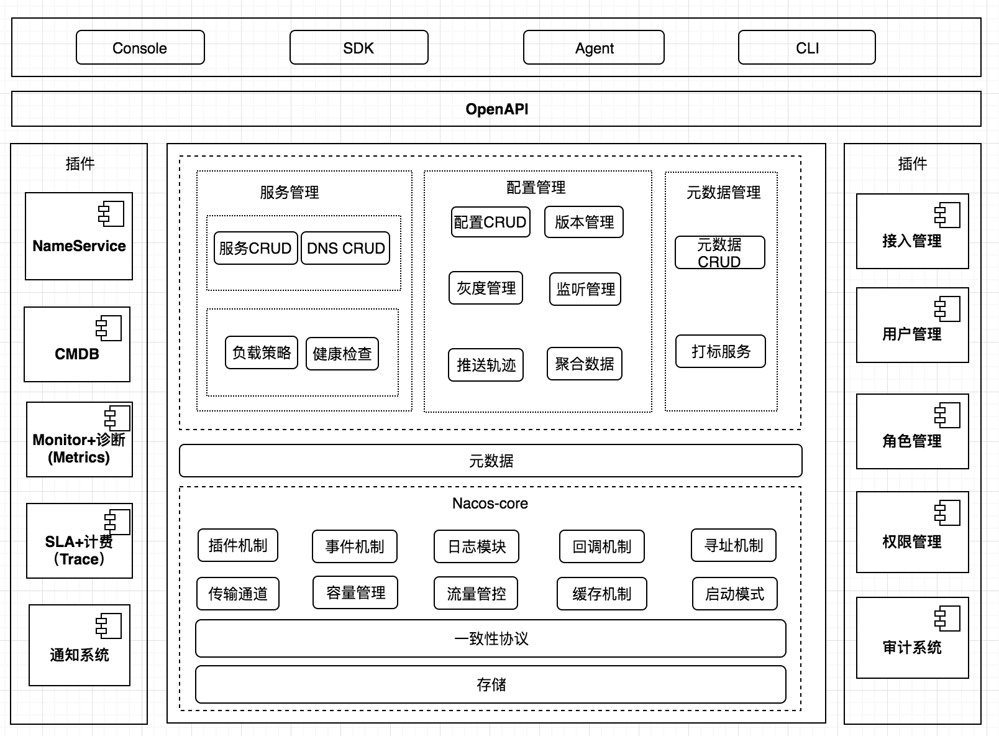
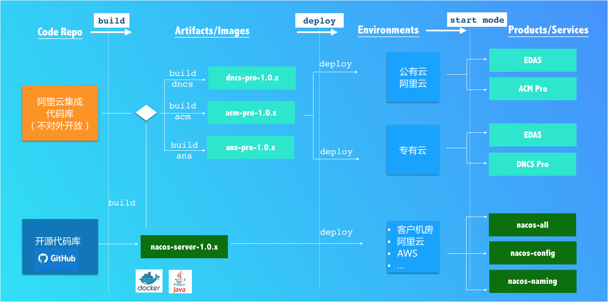

# ☁️ Spring Cloud


## 💬 微服务序言


### 🚀 微服务架构概述


​		微服务架构时一种架构模式，它提倡将单一应用程序划分成一组小的服务，服务之间互相协调、互相配合，为哟过户提供最终价值。每个服务运行在其独立的进程中，服务与服务间采用轻量级的通信机制互相协作（通常是基于HTTP协议的Restful API）。每个服务都围绕着具体业务进行构建，并且能够别独立的部署到生产环境、类生产环境等。另外，应该尽量避免同一的、集中式的服务管理机制，对具体的一个服务而言，应根据业务上下文，选择合适的语言、工具进行构建。


###  📖 Spring Cloud简介

Spring Cloud = 分布式微服务架构的一站式解决方案。


> 分布式微服务

- 服务注册与发现
- 服务调用
- 服务熔断
- 负载均衡
- 服务降级
- 服务消息队列
- 配置中心管理
- 服务网关
- 服务监控
- 全链路追踪
- 自动化构建部署
- 服务定时任务调度操作




> Cloud升级




### 🏳️‍🌈 版本选型


> 官网限定：https://spring.io/projects/spring-cloud

截止 2020-11-25

| Spring Cloud Version                                         | Spring Boot Version              |
| :----------------------------------------------------------- | :------------------------------- |
| 2020.0.x aka Ilford                                          | 2.4.x                            |
| [Hoxton](https://github.com/spring-projects/spring-cloud/wiki/Spring-Cloud-Hoxton-Release-Notes) | 2.2.x, 2.3.x (Starting with SR5) |
| [Greenwich](https://github.com/spring-projects/spring-cloud/wiki/Spring-Cloud-Greenwich-Release-Notes) | 2.1.x                            |
| [Finchley](https://github.com/spring-projects/spring-cloud/wiki/Spring-Cloud-Finchley-Release-Notes) | 2.0.x                            |
| [Edgware](https://github.com/spring-projects/spring-cloud/wiki/Spring-Cloud-Edgware-Release-Notes) | 1.5.x                            |
| [Dalston](https://github.com/spring-projects/spring-cloud/wiki/Spring-Cloud-Dalston-Release-Notes) | 1.5.x                            |


> 具体限定：https://start.spring.io/actuator/info

截止 2020-11-25

```json

    "spring-cloud": {
      "Finchley.M2": "Spring Boot >=2.0.0.M3 and <2.0.0.M5",
      "Finchley.M3": "Spring Boot >=2.0.0.M5 and <=2.0.0.M5",
      "Finchley.M4": "Spring Boot >=2.0.0.M6 and <=2.0.0.M6",
      "Finchley.M5": "Spring Boot >=2.0.0.M7 and <=2.0.0.M7",
      "Finchley.M6": "Spring Boot >=2.0.0.RC1 and <=2.0.0.RC1",
      "Finchley.M7": "Spring Boot >=2.0.0.RC2 and <=2.0.0.RC2",
      "Finchley.M9": "Spring Boot >=2.0.0.RELEASE and <=2.0.0.RELEASE",
      "Finchley.RC1": "Spring Boot >=2.0.1.RELEASE and <2.0.2.RELEASE",
      "Finchley.RC2": "Spring Boot >=2.0.2.RELEASE and <2.0.3.RELEASE",
      "Finchley.SR4": "Spring Boot >=2.0.3.RELEASE and <2.0.999.BUILD-SNAPSHOT",
      "Finchley.BUILD-SNAPSHOT": "Spring Boot >=2.0.999.BUILD-SNAPSHOT and <2.1.0.M3",
      "Greenwich.M1": "Spring Boot >=2.1.0.M3 and <2.1.0.RELEASE",
      "Greenwich.SR6": "Spring Boot >=2.1.0.RELEASE and <2.1.999.BUILD-SNAPSHOT",
      "Greenwich.BUILD-SNAPSHOT": "Spring Boot >=2.1.999.BUILD-SNAPSHOT and <2.2.0.M4",
      "Hoxton.SR9": "Spring Boot >=2.2.0.M4 and <2.3.7.BUILD-SNAPSHOT",
      "Hoxton.BUILD-SNAPSHOT": "Spring Boot >=2.3.7.BUILD-SNAPSHOT and <2.4.0.M1",
      "2020.0.0-M3": "Spring Boot >=2.4.0.M1 and <=2.4.0.M1",
      "2020.0.0-M4": "Spring Boot >=2.4.0.M2 and <=2.4.0-M3",
      "2020.0.0-M5": "Spring Boot >=2.4.0.M4 and <2.4.1-SNAPSHOT",
      "2020.0.0-SNAPSHOT": "Spring Boot >=2.4.1-SNAPSHOT"
    },
    "spring-cloud-alibaba": {
      "2.2.1.RELEASE": "Spring Boot >=2.2.0.RELEASE and <2.3.0.M1"
    },
```


> 技术选型




```xml
<?xml version="1.0" encoding="UTF-8"?>

<project xmlns="http://maven.apache.org/POM/4.0.0" xmlns:xsi="http://www.w3.org/2001/XMLSchema-instance"
         xsi:schemaLocation="http://maven.apache.org/POM/4.0.0 http://maven.apache.org/xsd/maven-4.0.0.xsd">
  <modelVersion>4.0.0</modelVersion>

  <groupId>top.parak.springcloud</groupId>
  <artifactId>cloud2020</artifactId>
  <version>1.0-SNAPSHOT</version>
  <packaging>pom</packaging>

  <developers>
    <developer>
      <name>KHighness</name>
      <email>parakovo@gmail.com</email>
    </developer>
  </developers>

  <modules>
  </modules>

  <!-- Jar Version Management-->
  <properties>
    <project.build.sourceEncoding>UTF-8</project.build.sourceEncoding>
    <maven.compiler.source>1.8</maven.compiler.source>
    <maven.compiler.target>1.8</maven.compiler.target>
    <java.version>1.8</java.version>
    <junit.version>4.12</junit.version>
    <log4j.version>1.2.17</log4j.version>
    <lombok.version>1.18.16</lombok.version>
    <mysql.version>8.0.20</mysql.version>
    <fastjson.version>1.2.75</fastjson.version>
    <druid.version>1.2.3</druid.version>
    <spring.boot.version>2.2.2.RELEASE</spring.boot.version>
    <spring.cloud.version>Hoxton.SR1</spring.cloud.version>
    <spring.cloud.alibaba.version>2.1.0.RELEASE</spring.cloud.alibaba.version>
    <druid.spring.boot.starter.version>1.2.3</druid.spring.boot.starter.version>
    <mybatis.spring.boot.starter.version>2.1.1</mybatis.spring.boot.starter.version>
    <mybatis-plus.boot.starter.version>3.4.1</mybatis-plus.boot.starter.version>
    <hutool-all.version>5.5.1</hutool-all.version>
  </properties>

  <dependencyManagement>
    <dependencies>

      <!-- Spring Boot -->
      <dependency>
        <groupId>org.springframework.boot</groupId>
        <artifactId>spring-boot-dependencies</artifactId>
        <version>${spring.boot.version}</version>
        <type>pom</type>
        <scope>import</scope>
      </dependency>

      <!-- Spring Cloud -->
      <dependency>
        <groupId>org.springframework.cloud</groupId>
        <artifactId>spring-cloud-dependencies</artifactId>
        <version>${spring.cloud.version}</version>
        <type>pom</type>
        <scope>import</scope>
      </dependency>

      <!-- Spring Cloud alibaba -->
      <dependency>
        <groupId>com.alibaba.cloud</groupId>
        <artifactId>spring-cloud-alibaba-dependencies</artifactId>
        <version>${spring.cloud.alibaba.version}</version>
        <type>pom</type>
        <scope>import</scope>
      </dependency>

      <!-- Mysql -->
      <dependency>
        <groupId>mysql</groupId>
        <artifactId>mysql-connector-java</artifactId>
        <version>${mysql.version}</version>
        <scope>runtime</scope>
      </dependency>

      <!-- Druid-->
      <dependency>
        <groupId>com.alibaba</groupId>
        <artifactId>druid</artifactId>
        <version>${druid.version}</version>
      </dependency>

      <!-- Mybatis Starter -->
      <dependency>
        <groupId>org.mybatis.spring.boot</groupId>
        <artifactId>mybatis-spring-boot-starter</artifactId>
        <version>${mybatis.spring.boot.starter.version}</version>
      </dependency>

      <!-- Druid Starter -->
      <dependency>
        <groupId>com.alibaba</groupId>
        <artifactId>druid-spring-boot-starter</artifactId>
        <version>${druid.spring.boot.starter.version}</version>
      </dependency>

      <!-- Junit -->
      <dependency>
        <groupId>junit</groupId>
        <artifactId>junit</artifactId>
        <version>${junit.version}</version>
        <scope>test</scope>
      </dependency>

      <!-- Lombok -->
      <dependency>
        <groupId>org.projectlombok</groupId>
        <artifactId>lombok</artifactId>
        <version>${lombok.version}</version>
        <scope>provided</scope>
      </dependency>

      <!-- Fastjson -->
      <dependency>
        <groupId>com.alibaba</groupId>
        <artifactId>fastjson</artifactId>
        <version>${fastjson.version}</version>
      </dependency>

    </dependencies>
  </dependencyManagement>

  <build>
    <plugins>
      <plugin>
        <groupId>org.springframework.boot</groupId>
        <artifactId>spring-boot-maven-plugin</artifactId>
        <configuration>
          <fork>true</fork>
          <addResources>true</addResources>
        </configuration>
      </plugin>
    </plugins>
  </build>

</project>
```


## 💠 服务注册中心


### 🌠 Eureka


> 概述

Github: https://github.com/Netflix/Eureka

Spring Cloud Eureka 是 Spring Cloud Netflix 微服务套件的一部分，基于 Netflix Eureka 做了二次封装，主要负责实现微服务架构中的服务治理功能。Spring Cloud Eureka 是一个基于 REST 的服务，并且提供了基于Java的客户端组件，能够非常方便地将服务注册到 Spring Cloud Eureka 中进行统一管理。


> 服务治理

在传统的RPC远程调用框架中，管理每个服务于服务之间的依赖关系比较复杂，所以需要使用服务治理，管理服务与服务之间的依赖关系，可以实现服务调用、负载均衡、容错等，实现服务发现与注册。


> 服务注册与发现

Eureka采用了CS的设计架构，Eureka Server作为服务注册功能的服务器，它是服务注册中心，而系统中的其他微服务，使用Eureka的客户端连接到Eureka Server并维持心跳连接。这样系统的维护人员就可以通过Eureka Server来监控系统中各个微服务是否正常运行。

在服务注册与发现中心，有一个注册中心，当服务器启动的时候，会把自己服务器的信息比如服务地址、通讯地址等以别名方式注册到注册中心上。另一方（消费者|服务提供者），以该别名的方式去注册中心上获取到实际的服务通讯地址，然后再实现本地RPC调用RPC远程调用框架核心设计思想：在于注册中心，因为使用注册中心管理每个服务于服务之间的一个依赖关系（服务治理概念）。在任何RPC远程框架中，都会有一个注册中心（存放服务地址相关信息（接口地址））。


> Eureka组件：Eureka Server和Eureka Client

1️⃣ Eureka Server提供服务注册服务

各个微服务节点通过配置启动后，会在Eureka Server中进行注册，这样Eureka Server中的服务注册表将会存储所有可用服务节点的信息，服务节点的信息可以在界面中直观看到。

2️⃣ Eureka Client通过注册中心进行访问

是一个Java客户端，用于简化Eureka Sever的交互，客户端同时也具备一个内置的、使用轮询负载算法的负载均衡器。在应用启动后，将会在Eureka Server发送心跳(默认周期为30S)。如果Eureka Server在多个心跳周期内没有接收到某个节点的心跳，Eureka Server将会从服务注册表中把这个服务节点移除。


> Eureka的自我保护模式

1️⃣概述

默认情况下，如果Eureka Server在一定时间内没有接收到某个微服务实例的心跳，Eureka Server将会注销该实例（默认90秒）。但是当前网络分区故障发生（延时、卡顿、拥挤）时，微服务与Eureka Server之间无法正常通信，以上行为会变得危险——因为微服务本身是健康的，此时本不应该注销这个微服务。Eureka通过“自我保护模式”来解决这个问题————当Eureka节点在短时间内丢失过多客户端时候，那么这个节点就进入自我保护模式。

2️⃣用途

保护模式主要用于一组Eureka Client和Eureka Server之间存在网络分区场景下的保护。一旦进入保护模式，Eureka Server将会尝试保护其微服务注册表中的信息，不再删除服务注册表中的数据，也就是不会注销任何微服务。使用自我保护模式，可以让Eureka集群更加的健壮、稳定。

3️⃣设计哲学

宁可保护错误的服务注册信息，也不盲目注销任何可能健康的服务实例。

4️⃣关闭自我保护模式

Eureka的自我保护模式默认是开启的，关闭需要配置Eureka Server：

```yml
eureka:
  server:
    # 关闭自我保护模式，对没有心跳的微服务直接杀无赦，保证不可用服务及时踢除
    enable-self-preservation: false 
    # 清理无效节点的时间间隔，默认是60000ms
    eviction-interval-timer-in-ms: 2000
```

重启Eureka Server进入Eureka可视化，可以看到这句话：

```plaintext
THE SELF PRESERVATION MODE IS TURNED OFF. THIS MAY NOT PROTECT INSTANCE EXPIRY IN CASE OF NETWORK/OTHER PROBLEMS.
```

配置Eureka Client

```properties
eureka:
  instance:
    # Eureka Client向Eureka Server发送心跳的时间间隔/频率，单位为秒(默认是30S)
    # 在这个时间间隔后，Eureka Server没有收到Eureka client的心跳，将剔除服务
    lease-renewal-interval-in-seconds: 1
    # Eureka Server在收到最后一次心跳后等待时间上限，单位为秒(默认是90S)
    # 超时将剔除服务
    lease-expiration-duration-in-seconds: 2
```

开启微服务并且很快停止，可以看到Eureka Server的日志上1s过期了一个服务，Eureka可视化上注册的服务直接消失


> Eureka停更说明

Eureka 2.x停止更新，Eureka 1.x 在开源社区依然活跃。

[eureka-wiki](https://github.com/Netflix/eureka/wiki)

The existing open source work on eureka 2.0 is discontinued. The code base and artifacts that were released as part of the existing repository of work on the 2.x branch is considered use at your own risk.

Eureka 1.x is a core part of Netflix's service discovery system and is still an active project.


### 💤 ZooKeeper


> 概述

官网: [apache-zookeeper](https://zookeeper.apache.org/)

wiki文档: [wiki-zookeeper](https://cwiki.apache.org/confluence/display/ZOOKEEPER/Index)

ZooKeeper是用于维护配置信息，命名，提供分布式同步以及提供组服务的集中式服务。


> Docker运行Zookeeper

```shell
$ docker pull zookeeper
$ docker run -d -it -p 2181:2181 --name=zoo zookeeper
```


> POM

```xml
<dependencies>
    <!-- SpringBoot整合Zookeeper客户端 -->
    <dependency>
        <groupId>org.springframework.cloud</groupId>
        <artifactId>spring-cloud-starter-zookeeper-discovery</artifactId>
        <exclusions>
            <!-- 排除自带的zookeeper3.5.3 -->
            <exclusion>
                <groupId>org.apache.zookeeper</groupId>
                <artifactId>zookeeper</artifactId>
            </exclusion>
        </exclusions>
    </dependency>
    <!-- 添加zookeeper3.4.14 -->
    <dependency>
        <groupId>org.apache.zookeeper</groupId>
        <artifactId>zookeeper</artifactId>
        <version>3.4.14</version>
        <!-- 排除自带的Slf4j -->
        <exclusions>
            <exclusion>
                <artifactId>slf4j-log4j12</artifactId>
                <groupId>org.slf4j</groupId>
            </exclusion>
        </exclusions>
    </dependency>
</dependencies>
```


### 💫 Consul


> 概述

官网：[Consul](https://www.consul.io/docs/intro)

入门文档：[spring-cloud-consul](https://www.springcloud.cc/spring-cloud-consul.html)

Consul(Go语言开发)是一种服务网格解决方案，提供具有服务发现，配置和分段功能的全功能控制平面。


> Docker运行Consul

```shell
$ mkdir -p /home/consul/data /home/consul/conf
$ docker run -d --name=con -p 8500:8500  -v /home/consul/conf/:/consul/conf/                   -v /home/consul/data/:/consul/data/ consul
```

Consul有前端可视化界面，此时输入虚拟机IP:8500即可访问。


> POM

```xml
<dependencies>
    <!-- SpringCloud Consul Server -->
    <dependency>
        <groupId>org.springframework.cloud</groupId>
        <artifactId>spring-cloud-starter-consul-discovery</artifactId>
    </dependency>
</dependencies>
```


### 🌀 CAP


> CAP原则

在一个分布式系统中：

- C(Consistency): 一致性(All nodes see the same data at the same time)

- A(Availability): 可用性(Reads and writes always succeed)

- P(Partition tolerance): 分区容错性(The system continues to operate despite arbitrary message loss or failure of part of the system)

以上三点只能满足任意两点，不可能三者兼顾。


> 三个注册中心

现在的分布式微服务架构都必须保证P原则

|  组件名   | 语言 | CAP  | 服务健康检查 | 对外暴露接口 | Spring Cloud集成 |
| :-------: | :--: | :--: | :----------: | :----------: | :--------------: |
|  Eureka   | Java |  AP  |   可配支持   |     HTTP     |      已集成      |
|  Consul   |  Go  |  CP  |     支持     |   HTTP/DNS   |      已集成      |
| Zookeeper | Java |  CP  |     支持     |    客户端    |      已集成      |


## 🔱 服务调用


### 🎗Ribbon


> 说明

wiki文档：[wiki-ribbon](https://github.com/Netflix/ribbon/wiki)

Spring Cloud Ribbon是基于Netflix的开源项目，主要功能是提供客户端的软件负载均衡算法和服务调用。

Ribbon客户端组件提供一系列完善的配置项如连接超时、重试等。简单的说，就是在配置文件中列出Load Balancer（简称LB）后面所有的机器，Ribbon会自动的帮助你基于某种规则（如简单轮询，随机连接等）去连接这些机器。我们很容易使用Ribbon实现自定义的负载均衡算法。


> LB

Load Balance，负载均衡，将用户请求平摊到多个服务器上，从而达到系统的HA（高可用）。


> 核心组件IRule



1️⃣根据特定算法从服务列表中选取一个要访问的服务：

- RoundRobinRule: 轮询(默认)
- RandomRule: 随机
- RetryRule: 先按照RoundRule的策略获取服务，如果服务失败则在指定时间内进行重试，获取可用的服务
- WeightedResponseTimeRule: 对RoundRobinRule的扩展，响应速度越快的实例选择权重越大，越容易被选择
- BestAvaiableRule: 会先过滤掉由于多次访问故障而处于断路器跳闸状态的服务，然后选择一个并发量小的服务
- AvailabilityFilteringRule: 先过滤掉故障实例，再选择并发较小的实例
- ZoneAvoidanceRule: 默认规则，复合判断server所在区域的性能和server的可用性选择服务器

2️⃣自定义算法的规则（官方文档警告）：

自定义配置类不能放在@ComponentScan所扫描的当前包以及子包下，否则自定义的这个配置类就会被所有的Ribbon客户端共享，达不到特殊定制化的目的。

@SpringBootApplication包含三大注解：

- @SpringBootConfiguration

- @EnableAutoConfiguration
- @ComponentScan

因此，自定义配置类不能与SpringbootApplication主启动类放在一个包下。


### 🛑 OpenFeign


> 概述

Feign是一个声明式WebService客户端，使用Feign能让编写Web Service客户端更加简单。使用方法时定义一个服务接口然后在上面添加注解。Feign也支持可拔插式的编码器和解码器。Spring Cloud对Feign进行了封装，使其支持了Spring MVC标准注解和HttpMessageConverters。Feign可以与Eureka和Ribbon组合使用以支持负载均衡。

Feign旨在使编写Java Http客户端变得更容易。

前期使用Ribbon + RestTemplate时，使用RestTemplate对http请求的封装处理，形成了一套模板化的调用方法。但是在实际开发中，由于对服务依赖的调用可能不止一处，往往一个接口会被多处调用，所以通常都会针对每个微服务自行封装一些客户端类来包装这些依赖服务的调用。所以，Feign在此基础上来配置它（以前是Dao接口上标注一个Feign注解即可），即可完成对服务提供方的接口绑定，简化了使用Spring Cloud Ribbon时，自动封装服务调用客户端的开发量。

Feign集成了Ribbon。

利用Ribbon维护了Payment的服务列表信息，并且通过轮询实现端的负载均衡，而与Ribbon不同的是，通过Feign不同的是，通过Feign只需要定义服务绑定接口且以声明式的方法，优雅而简单的实现了服务调用。


|                            Feign                             |                          OpenFeign                           |
| :----------------------------------------------------------: | :----------------------------------------------------------: |
| Feign是SpringCloud组件中的一个轻量级RESTful的HTTP服务客户端。Feign内置了Ribbon，用来做客户端负载均衡，去调用服务注册中心的服务。Feign的使用方法：使用Feign的注解定义接口，调用这个接口，就可以调用服务注册中心的服务。 | OpenFeign是Spring Cloud在Feign的基础上支持了SpringMVC的注解，如@RequestMapping等等。OpenFeign的@FeignClient可以解析SpringMVC的@RequestMapping注解下的接口，并通过动态代理的方式产生实现类，实现类中做负载均衡并调用其他服务。 |
| <dependency>     <groupId>org.springframework.cloud</groupId>     <artifactId>spring-cloud-starter-feign</artifactId> </dependency> | <dependency>     <groupId>org.springframework.cloud</groupId>     <artifactId>spring-cloud-starter-openfeign</artifactId> </dependency> |


> 超时控制

默认Feign客户端只等待1秒钟，但是服务端处理需要超过1秒钟，导致Feign客户端不想等待，直接返回报错。为了避免这样的情况，有时候我们需要设置Feign客户端的超时控制。

```yml
# 设置feign客户端超时时间(Openfeign默认支持ribbon)
ribbon:
  # 指的是建立连接所用的时间，适用于网络状况正常的情况下，两端连接所用的时间
  ReadTimeout: 5000
  # 指的是建立连接后从服务器读取到可用资源所用的时间
  ConnectTimeout: 5000
```


## 🔰 服务降级


服务雪崩

多个微服务之间调用的时候，假设微服务A调用微服务B和微服务C，微服务B和微服务C又调用其他的服务器，这就是所谓的“扇出”。如果扇出的链路上某个微服务的调用响应时间过长或者不可用，对微服务A的调用就会占用越来越多的系统资源，进而引起系统崩溃，所谓的“雪崩效应”。

对于高流量的应用来说，单一的后端依赖可能会导致所有服务器上的所有资源都在几秒钟内饱和。比失败更糟糕的是，这些应用程序还可能导致服务之间的延迟增加，备份队列，线程和其他资源紧张，导致整个系统发生更多的级联故障。这些都表示需要对故障和延迟进行隔离和管理，以便单个依赖关系的失败，不能取消整个应用程序或系统。

通常一个模块下的某个实例失败后，这时候这个模块依然还会接收流量，然后这个有问题的模块还调用了其他的模块，这样就会发生级联故障，或者叫雪崩。


### ⚡ Hystrix


> 说明

Github: https://github.com/Netflix/Hystrix

Hystrix不再主动开发，并且当前处于维护模式。

Hystrix（1.5.18版）足够稳定，可以满足Netflix现有应用程序的需求。


> 概述

在分布式环境中，不可避免地会有许多服务依赖项中的某些失败。Hystrix是一个库，可通过添加延迟公差和容错逻辑来帮助您控制这些分布式服务之间的交互。Hystrix通过隔离服务之间的访问点，停止服务之间的级联故障并提供后备选项来实现此目的，以提高系统的整体弹性。

“断路器”本身是一种开关装置，当某个服务单元发生故障之后，通过断路器的故障监控（类似熔断保险丝），向调用方返回一个符合预期的、可处理的备选响应（Fallback），而不是长时间的等待或者抛出调用方无法处理的异常，这样就保证了服务调用方的线程不会被长时间、不必要地占用，从而避免了故障在分布式系统中的蔓延，乃至雪崩。


> 作用

- 提供保护并控制延迟和失败，以及通过第三方客户端库访问的依赖项的失败
- 停止复杂的分布式系统中的级联故障
- 快速失败并快速修复
- 回退并在可能的情况下正常降级
- 启用实时监视、警报和操作控制


> 并发场景

1️⃣并发场景及解决要求

- 超时导致服务器变慢（转圈）=> 超时不再等待
- 出错（宕机或程序运行出错）=> 出错要有兜底

2️⃣解决方案

- 服务提供者超时，服务调用者不能一直卡死等待，必须有服务降级
- 服务提供者宕机，服务调用者不能一直卡死等待，必须有服务降级
- 服务提供者正常，服务调用者自己出故障或有自我要求（自己的等待时间小于服务时间），


> 服务降级

1️⃣概念

当服务器压力剧增的情况下，根据当前业务情况及流量对一些服务和页面有策略的降级，以此释放服务器资源以保证核心任务的正常运行。

服务器忙，请稍后再试，不让客户端等待并立刻返回一个友好提示。

2️⃣触发

- 程序运行异常
- 超时
- 服务熔断
- 线程池/信号量打满

3️⃣解决

降级配置：

服务提供者设置自身调用超时时间的峰值，峰值内可以正常运行；

超过了需要有兜底的方法处理，作服务降级fallback。


> 服务熔断

1️⃣熔断机制

熔断机制是应对雪崩效应的一种微服务链路保护机制。当扇出链路的某个为副护出错不可用或者相响应时间太长时，会进行服务的降级，进而熔断该节点微服务的调用，快速返回错误的响应信息。

当扇出链路的某个微服务不可用或者响应时间太长时，会进行服务的降级，进而熔断该节点微服务的调用，快速返回”错误”的响应信息。当检测到该节点微服务响应正常后恢复调用链路。

2️⃣断路器

断路器的三个重要参数：

- 快照时间窗：断路器确定是否打开需要统计一下请求和错误数据，而统计的时间范围就是快照时间窗，默认为最近的10秒。
- 请求总数阈值：在快照时间窗内，必须满足请求总数阈值才有资格熔断。默认为20，意味着在10秒内，如果在hystrix命令的调用次数不足20次，即使所有的请z求都超时或其他原因失败，断路器都不会打开。
- 错误百分比阈值：当请求总数在快照时间窗内超过了阈值，比如发生了30次调用，如果在这30次调用中，有15次发生了超时异常，也就是超过50%的错误百分比，在默认设定50%阈值情况下，这时候就会将断路器打开。

开启或者关闭的条件：

- 当满足一定的阈值的时候（默认10秒内超过20哥请求次数）
- 当失败率达到一定的时候（默认10秒内超过50%的请求失败）
- 到达以上阈值，断路器将会开启
- 当开启的时候，所有请求都不会进行转发
- 一段时间之后（默认是5秒），这个时候断路器是半开状态，会让其中一个请求进行转发。如果成功，断路器会关闭，若失败，继续开启。重复4和5。

断路器打开之后：

- 再有请求调用的时候，将不会调用主逻辑，而是直接调用降级fallback，通过断路器，实现了自动地发现错误并将降级逻辑切换为主逻辑，减少响应延迟的效果。
- 恢复原来的主逻辑：
  - 对于这一问题，hystrix也为我们实现了自动恢复功能。
  - 当断路器打开，对主逻辑进行熔断之后，hystrix会启动一个休眠时间窗，在这个时间窗内，降级逻辑是临时的成为主逻辑，当休眠时间窗到期，断路器将进入半开状态，释放一次请求到原来的主逻辑上，如果此次请求正常返回，那么断路器将继续闭合，主逻辑恢复，如果这次请求依然有问题，断路器继续进入打开状态，休眠时间窗重新计时。


> Dashboard监控

Hystrix提供了准实时的调用监控（Hystrix Dashboard），Hystrix会持续地记录所有通过Hystrix发起的请求的执行信息，并以统计报表和图形的形式展示给用户，包括每秒执行多少请求成功、多少失败等。Netflix通过hystrix-metrics-event-stream项目实现了对以上指标的监控。Spring Cloud夜提供了Hystrix Dashboard的整合，对监控内容转换成可视化界面。


> POM

```xml
<dependency>
    <groupId>org.springframework.cloud</groupId>
    <artifactId>spring-cloud-starter-netflix-hystrix-dashboard</artifactId>
</dependency>
```

> YML

```yml
server:
  port: 9001

spring:
  application:
    name: cloud-consumer-hystrix-dashboard

eureka:
  client:
    register-with-eureka: true
    fetch-registry: true
    service-url:
      defaultZone: http://eureka7001.com:7001/eureka
  instance:
    prefer-ip-address: true
```

> Main

```java
@SpringBootApplication
@EnableHystrixDashboard
public class HystrixDashboardMain9001Application {
    public static void main(String[] args) {
        SpringApplication.run(HystrixDashboardMain9001Application.class, args);
    }
}
```

输入http://localhost:8001/hystrix.stream即可进行监控：




## 🌐服务网关


### 🎇Spring Cloud Gateway


> 概述

Spring Cloud Gateway时Spring Cloud的一个全新项目，基于Spring 5.0  + Spring Boot 2.0和Project Reactor等技术开发的网关，它旨在为微服务架构提供一种简单有效的统一的API路由管理方式。

SpringCloud Gateway作为Spring Cloud生态系统中的网关，目标是替代Zuul，在Spring Cloud 2.0以上版本中，没有对新版本的Zuul 2.0以上最新高性能版本进行集成，仍然还是使用的Zuul 1.x非Reactor模式的老版本，而为了提供网关的性能，SpringCloud Gateway是基于WebFlux框架实现的，而WebFlux框架底层则使用了高性能的Reactor模式通信框架Netty。

Spring Cloud Gateway的目标是提供统一的路由方式且基于Filter链的方式提供了网关基本的功能，例如：安全、监控/指标和限流。


> 核心概念

1️⃣Route(路由)

路由是构建网关的基本模块，它由ID、目标URI、一系列的断言和过滤器组成，如果断言为true则匹配该路由。

2️⃣Predicate(断言)

参考的是Java8的java.util.function.Predicate。开发人员可以匹配HTTP请求中的所有内容(例如请求头或请求参数)，如果请求与断言相匹配则进行路由。

3️⃣Filter(过滤)

指的是Spring框架中Gateway Filter的实例，使用过滤器，可以在请求被路由前或者之后对请求修改。


> 选型说明

- Zuul1.0已经进入维护阶段，Gateway是SpringCloud团队研发的，是亲儿子产品，值得信赖。而且Gateway很多功能Zuul都没有，用起来非常简单便捷。
- Gateway是基于异步阻塞模型上进行开发的，性能方面不需要担心。虽然Netfli早就发布了最新的Zuul2.x，但SpringCloud貌似没有整合计划。而且Netflix相关组件都宣布进入维护期，不知前景如何。


> 特性

- 基于Spring Framework 5 、Project Reactor和Spring Boot 2.0进行构建
- 动态路由：能够匹配任何请求属性
- 可以对路由指定Predicate(断言)和Filter(过滤器)
- 集成Hystrix的断路器功能
- 集成Spring Cloud服务发现功能
- 易于编写的Predicate(断言)和Filter(过滤器)
- 请求限流功能
- 支持路径重写


> SpringCloud Gateway与Zuul的区别

- Zuul 1.x是一个基于阻塞I/O的API Gateway。
- Zuul 1.x基于Servlet2.5使用阻塞架构它不支持任何长连接(如Websocket)。Zuul的设计模式和Nginx较像，每次I/O操作都是从工作线程中选择一个执行，请求线程被阻塞到工作线程完成，但是差别是Nginx用C++实现，Zuul用Java实现，而JVM本身会有第一次加载较慢的情况，使得Zuul的性能相对较差。
- Zuul 2.x理念更先进，想基于Netty非阻塞和支持长连接，但SpringCloud目前还没有整合。Zuul 2.x的性能较Zuul 1.x有较大提升。在性能方面，根据官方提供的基准测试，SpringCloud Gateway的RPS(每秒请求数)是Zuul的1.6倍。
- SpringCloud Gateway使用非阻塞API。
- SpringCloud Gateway还支持Websocket，并且与Spring紧密集成拥有更好的开发体验。


## 🔨 服务配置


### ⚙ Spring Cloud Config


📖分布式配置中心


> 概述

Spring Cloud Config为微服务架构中的微服务提供集中化的外部配置支持，配置服务器为各个不同微服务应用的所有环境提供了一个中心化的外部配置。


> 使用

Spring Cloud Config分为服务端和客户端两部分

- 服务端：分布式配置中心，它是一个独立的微服务应用，用来连接配置服务器并为客户端提供配置信息，加密/解密信息等访问接口。
- 客户端：通过指定的配置中心来管理应用资源，以及与业务相关的配置内容，并在启动的时候从配置中心获取和加载配置信息和配置服务器，默认采用git来存储配置信息，这样就有助于对环境配置进行版本管理，并且可以通过git客户端工具来方便的管理和访问配置内容。


### 🚌Spring Cloud Bus


📖消息总线


> 概述

在微服务架构的系统中，通过会使用轻量级的消息代理来构建一个共用的消息主题，并让系统中所有微服务实例都连接上来，由于该主题中产生的消息会被所有实例监听和消费，所以称它为消息总线。在总线上的各个实例，都可以方便地广播一些需要让其他连接在该主题上的实例都知道的消息。


> 原理

ConfigClient实例都监听MQ中同一个topic(默认是SpringCloudBus)。当一个服务刷新数据的时候，它会把这个消息放入到Topic中，这样其他监听同一Topic的服务就能得到通知，然后去更新自身的配置。


> Docker运行RabbitMQ

```shell
# 安装运行
docker run -d --name rabbitmq -p 5672:5672 -p 15672:15672 -v `pwd`/data:/var/lib/rabbitmq -e RABBITMQ_DEFAULT_VHOST=/  -e RABBITMQ_DEFAULT_USER=Khighness -e RABBITMQ_DEFAULT_PASS=KAG1823 rabbitmq
# 开启可视化
docker exec -it rabbitmq rabbitmq-plugins enable rabbitmq_management
```


### 🌊Spring Cloud Stream


📖消息驱动


> 概述

Spring Cloud Stream是一个构建消息驱动微服务的框架。

应用程序通过inputs或者outputs来与Spring Cloud Stream中binder对象交互。

通过配置来绑定，Spring Cloud Stream的binder对象负责与消息中间件交互。

通过使用Spring Intergration来连接消息代理中间件以实现消息事件驱动。

Spring Cloud Stream为一些供应商的消息中间件产品提供了个性化的自动化配置实现，引用了发布/订阅、消费组、分区三个核心概念。

目前仅支持**RabbitMQ**、**Kafka**。


> 设计思想

在没有绑定器这个概念的情况下，SpringBoot应用要直接与消息中间件进行信息交互的时候，由于各消息中间件构建的初衷不同，它们的实现细节上会有较大的差异性。

**通过定义绑定器作为中间层，完美地实现了应用程序与消息中间件之间的隔离。**

通过向应用程序暴露统一的Channel通道，使得应用程序不需要再考虑各种不同的消息中间件实现。


> 绑定器




> 标准流程套路

- Binder: 很方便的连接中间件，屏蔽差异
- Channel: 通道，是队列Queue的一种抽象，在消息通讯系统中就是实现存储和转发的媒介，通过Channel对队列进行配置
- Source和Sink: 从Stream发布消息就是输出，接收消息就是输入


> 编码常用注解



| 组成            | 说明                                                         |
| --------------- | ------------------------------------------------------------ |
| Middleware      | 中间件，目前只支持RabbitMQ和Kafka                            |
| Binder          | Binder是应用与消息中间件之间的封装，目前实行了Kafka和RabbitMQ的Binder，通过Binder可以很方便的连接中间件，可以动态的改变消息类型(对于Kafka的topic，RabbitMQ的exchange)，这些都可以通过配置文件来实现 |
| @Input          | 注解标识输入通道，通过该输入通道接收到的消息进入应用程序     |
| @Output         | 注解标识输出通道，发布的消息将通过该通道离开应用程序         |
| @StreamListener | 监听队列，用于消费者的队列的消息接收                         |
| @EnableBinding  | 指信道channel和exchange绑定在一起                            |


### 📸 Spring Cloud Sleuth


> 痛点

在微服务框架中，一个由客户端发起的请求在后端系统中会经过多个不同的服务节点调用来协同产生最后的请求结果，每一个前端请求都会形成一个复杂的分布式服务调用链路，链路中的任何一环出现高延迟或错误都会引起整个请求最后的失败。


> zipkin

- jar

下载：https://dl.bintray.com/openzipkin/maven/io/zipkin/java/zipkin-server/

运行：`java -jar zipkin-server-2.12.9-exec.jar`

- docker

下载：`docker pull openzipkin/zipkin`

运行：`docker run -d --restart always -p 9411:9411 --name zipkin openzipkin/zipkin `


 ## 💥 阿里巴巴


### 🔥  Spring Cloud Alibaba


> 背景

博客原文：[spring-cloud-greenwich-rc1-available-now](https://spring.io/blog/2018/12/12/spring-cloud-greenwich-rc1-available-now)

Spring Cloud Netflix项目进入维护模式

以下Spring Cloud Netflix模块和相应的启动程序将进入维护模式：

1. spring-cloud-netflix-archaius
2. spring-cloud-netflix-hystrix-contract
3. spring-cloud-netflix-hystrix-dashboard
4. spring-cloud-netflix-hystrix-stream
5. spring-cloud-netflix-hystrix
6. spring-cloud-netflix-ribbon
7. spring-cloud-netflix-turbine-stream
8. spring-cloud-netflix-turbine
9. spring-cloud-netflix-zuul

这不包括Eureka或并发限制模块。


> 诞生

2018-10-31，Spring Cloud Alibaba正式入驻了Spring Cloud官方孵化器，并在Maven中央仓库发布了第一个版本。

官方文档：[spring-cloud-alibaba](https://spring-cloud-alibaba-group.github.io/github-pages/greenwich/spring-cloud-alibaba.html#_introduction)


> 功能

- 服务限流降级：默认支持Servlet、Feign、RestTemplate、Duddo和RocketMQ限流降级功能的接入，可以在运行时通过控制台修改限流降级规则，还支持查看限流降级Metrics监控。
- 服务注册与发现：适配Spring Cloud服务注册与发现标准，默认集成了Ribbon的支持。
- 分布式配置管理：支持分布式系统中的外部化配置，配置更改时自动刷新。
- 消息驱动能力：基于Spring Cloud Stream为微服务应用构建消息驱动能力。
- 阿里云对象存储：阿里云提供海量、安全、低成本、高可靠的云存储服务。支持在任何应用、任何时间、任何地点存储和访问任意类型的数据。
- 分布式任务调度：提供秒级、精准、高可靠、高可用的定时（基于Cron表达式）任务调度服务，同时提供分布式的任务执行模型，如网格任务。网格任务支持海量子任务均匀分配到所有Worker（schedulex-client）上执行。


### ♾️Nacos


> 概述

一个更易于构建云原生应用的动态服务发现、配置管理和服务管理平台，即注册中心和配置中心的组合。

理解：Nacos = Eureka + Config + Bus

官网：[nacos](http://nacos.io)


> Docker运行Nacos

```shell
# 下载镜像
docker pull nacos/nacos-server:1.1.4 

# 创建配置文件和日志文件目录
mkdir -p /opt/nacos/single/init.d /opt/nacos/single/logs 
cd /opt/nacos/single/init.d && touch custom.properties

# custom.properties文件中填写如下配置
server.contextPath=/nacos
server.port=8848
management.endpoints.web.exposure.include=*

# 创建并启动容器
docker run -d -p 8848:8848 -e MODE=standalone \
-v /opt/nacos/single/init.d/custom.properties:/home/nacos/init.d/custom.properties \
-v /opt/nacos/single/logs:/home/nacos/logs \
--restart always \
--name nacos nacos/nacos-server:1.1.4 
```


> 界面

打开浏览器输入: http://ip:8848/nacos，账号密码均为：nacos




> 架构

- 基础架构


- 逻辑架构



- 全景架构




> CAP

nacos支持CP和AP之间的切换：

- 如果不需要存储服务级别的信息且服务实例是通过nacos-client注册，并能够保持心跳上报，那么就可以选择AP模式。当前主流的服务如Spring Cloud和Dubbo服务，都适用于AP模式，AP模式为了服务的可能性而减弱了一致性，因此AP模式下只支持注册临时实例。
- 如果需要在服务级别编辑或者存储配置信息，那么CP是必须的。K8S和DNS服务器则适用于CP模式。CP模式下支持注册持久化实例，此时则是以Raft协议为集群运行模式，该模式下注册实例之前必须先注册服务，如果服务不存在，则会返回错误。


> 加载配置

- DataID方案

  指定`spring.profie.active`和配置文件的`DataID`来使不同环境下读取不同的配置

- Group方案

  指定`spring.cloud.nacos.config.group`来指定不同分组的配置

- NameSpace方案

  指定`spring.cloud.nacos.config.namespace`来指定不同命名空间的配置

总结，NameSpace包含Group，Group包含DataID。


> 部署模式

Nacos支持三种部署模式：

- 单机模式-用于测试和单机使用
- 集群模式-用于生产环境，确保高可用
- 多集群模式-用于多数据中心场景


> 持久化

默认Nacos使用嵌入式数据库实现数据的存储。所以，如果启动多个默认配置下的Nacos节点，数据存储是存在一致性问题的。为了解决这个问题，Nacos采用了集中式存储的方式来支持集群化部署，目前只支持MySQL的存储。


> 使用MySQL

```shell
# 创建配置文件和日志文件目录
mkdir -p /opt/nacos/single/init.d /opt/nacos/single/logs 
cd /opt/nacos/single/init.d && touch custom.properties

# custom.properties文件中填写如下配置
server.contextPath=/nacos
server.servlet.contextPath=/nacos
server.port=8848
spring.datasource.platform=mysql

db.num=1
db.url.0=jdbc:mysql://172.17.0.5:3306/nacos_config?characterEncoding=utf8&connectTimeout=1000&socketTimeout=3000&autoReconnect=true
db.user=root
db.password=KAG1823

nacos.cmdb.dumpTaskInterval=3600
nacos.cmdb.eventTaskInterval=10
nacos.cmdb.labelTaskInterval=300
nacos.cmdb.loadDataAtStart=false

management.metrics.export.elastic.enabled=false
management.metrics.export.influx.enabled=false
server.tomcat.accesslog.enabled=true
server.tomcat.accesslog.pattern=%h %l %u %t "%r" %s %b %D %{User-Agent}i
nacos.security.ignore.urls=/,/**/*.css,/**/*.js,/**/*.html,/**/*.map,/**/*.svg,/**/*.png,/**/*.ico,/console-fe/public/**,/v1/auth/login,/v1/console/health/**,/v1/cs/**,/v1/ns/**,/v1/cmdb/**,/actuator/**,/v1/console/server/**
nacos.naming.distro.taskDispatchThreadCount=1
nacos.naming.distro.taskDispatchPeriod=200
nacos.naming.distro.batchSyncKeyCount=1000
nacos.naming.distro.initDataRatio=0.9
nacos.naming.distro.syncRetryDelay=5000
nacos.naming.data.warmup=true
nacos.naming.expireInstance=true

# 创建并启动容器
docker run --name nacos -p 8848:8848   \
--privileged=true \
--restart=always \
-e JVM_XMS=256m \
-e JVM_XMX=256m \
-e MODE=standalone \
-e PREFER_HOST_MODE=hostname \
-v /opt/nacos/single/logs:/home/nacos/logs \
-v /opt/nacos/single/init.d/custom.properties:/home/nacos/init.d/custom.properties \
-d nacos/nacos-server:1.3.1
```


> 集群

```shell
docker run -d \
-e MODE=cluster \
-e NACOS_APPLICATION_PORT=8849 \
-e NACOS_SERVERS=192.168.117.155:8849,192.168.117.155:8850,192.168.117.155:8851 \
-e SPRING_DATASOURCE_PLATFORM=mysql \
-e MYSQL_SERVICE_HOST=192.168.117.155 \
-e MYSQL_SERVICE_PORT=3306 \
-e MYSQL_SERVICE_USER=root \
-e MYSQL_SERVICE_PASSWORD=KAG1823 \
-e MYSQL_SERVICE_DB_NAME=nacos_config \
-e NACOS_SERVER_IP=192.168.117.155 \
-p 8849:8849 \
--name nacos8849 \
nacos/nacos-server:1.3.1
 
docker run -d \
-e MODE=cluster \
-e NACOS_APPLICATION_PORT=8850 \
-e NACOS_SERVERS=192.168.117.155:8849,192.168.117.155:8850,192.168.117.155:8851 \
-e SPRING_DATASOURCE_PLATFORM=mysql \
-e MYSQL_SERVICE_HOST=192.168.117.155 \
-e MYSQL_SERVICE_PORT=3306 \
-e MYSQL_SERVICE_USER=root \
-e MYSQL_SERVICE_PASSWORD=KAG1823 \
-e MYSQL_SERVICE_DB_NAME=nacos_config \
-e NACOS_SERVER_IP=192.168.100.132 \
-p 8850:8850 \
--name nacos8850 \
nacos/nacos-server:1.3.1
 
docker run -d \
-e MODE=cluster \
-e NACOS_APPLICATION_PORT=8851 \
-e NACOS_SERVERS=192.168.117.155:8849,192.168.117.155:8850,192.168.117.155:8851 \
-e SPRING_DATASOURCE_PLATFORM=mysql \
-e MYSQL_SERVICE_HOST=192.168.117.155 \
-e MYSQL_SERVICE_PORT=3306 \
-e MYSQL_SERVICE_USER=root \
-e MYSQL_SERVICE_PASSWORD=KAG1823 \
-e MYSQL_SERVICE_DB_NAME=nacos_config \
-e NACOS_SERVER_IP=192.168.100.132 \
-p 8851:8851 \
--name nacos8851 \
nacos/nacos-server:1.3.1
```


### 🛡️ Sentinel


> 文档

https://github.com/alibaba/Sentinel/wiki/%E4%BB%8B%E7%BB%8D


> 概述

随着微服务的流行，服务和服务之间的稳定性变得越来越重要。Sentinel 以流量为切入点，从流量控制、熔断降级、系统负载保护等多个维度保护服务的稳定性。

Sentinel 具有以下特征:

- **丰富的应用场景**：Sentinel 承接了阿里巴巴近 10 年的双十一大促流量的核心场景，例如秒杀（即突发流量控制在系统容量可以承受的范围）、消息削峰填谷、集群流量控制、实时熔断下游不可用应用等。
- **完备的实时监控**：Sentinel 同时提供实时的监控功能。您可以在控制台中看到接入应用的单台机器秒级数据，甚至 500 台以下规模的集群的汇总运行情况。
- **广泛的开源生态**：Sentinel 提供开箱即用的与其它开源框架/库的整合模块，例如与 Spring Cloud、Dubbo、gRPC 的整合。您只需要引入相应的依赖并进行简单的配置即可快速地接入 Sentinel。
- **完善的 SPI 扩展点**：Sentinel 提供简单易用、完善的 SPI 扩展接口。您可以通过实现扩展接口来快速地定制逻辑。例如定制规则管理、适配动态数据源等。


> Docker运行Sentinel

```shell
docker pull bladex/sentinel-dashboard
docker run --name sentinel -d -p 8858:8858 -d bladex/sentinel-dashboard
```


> 流控规则

1️⃣解释说明

- 资源名：唯一路径，默认请求路径
- 针对来源：Sentinel可以针对调用者进行限流，填写微服务名，默认default
- 阈值类型/单机阈值：
  - QPS（每秒钟的请求数量）：当乔勇该API的QPS达到阈值的时候，进行限流
  - 线程数：当调用该API的线程数达到阈值的时候，进行限流

2️⃣流控模式

- 直接：API达到线路条件时，直接限流
- 关联：当关联的资源达到阈值时，就限流自己
- 链路：只记录指定链路上的流量（指定资源从入口资源进来的流量，如果达到阈值，就进行限流）

3️⃣流控效果

- 快速失败：默认的流量控制方式，当QPS超过任意规则的阈值后，新的请求就会被立即拒绝，拒绝方式为抛出`FlowException`。 [Blocked by Sentinel (flow limiting)]

- Warm Up(预热/冷启动)：当系统长期处于低水位的情况下，当流量突然增加时，直接把系统拉升到高水位可能瞬间把系统压垮。通过"冷启动"，让通过的流量缓慢增加，在一定时间内逐渐增加到阈值上限，给冷系统一个预热的时间，避免冷系统被压垮。

  [根据codeFactor（冷加载因子，默认3），经过预热时长，才达到设置的QPS阈值]

- 排队等待：匀速排队方式会严格控制请求通过的间隔时间，也即是让请求以均匀的速度通过，对应的是漏桶算法。[设置QPS控制间隔时间，间隔时间=1000ms/QPS，例如QPS=2时每隔500ms才允许下一个请求]


> 降级规则

1️⃣解释说明

Sentinel熔断降级会在调用链路中某个资源出现不稳定状态时（例如调用超时或异常比例升高），对这个资源的调用进行限制，让请求快速失败，避免影响到其他的资源而导致级联错误。

当资源降级后，在接下来的降级时间窗口内，对该资源的调用都自动熔断（默认行为是抛出`DegradeException`）。

2️⃣熔断策略

Sentinel 提供以下几种熔断策略：

- 慢调用比例 (`SLOW_REQUEST_RATIO`)：选择以慢调用比例作为阈值，需要设置允许的慢调用 RT（即最大的响应时间），请求的响应时间大于该值则统计为慢调用。当单位统计时长（`statIntervalMs`）内请求数目大于设置的最小请求数目，并且慢调用的比例大于阈值，则接下来的熔断时长内请求会自动被熔断。经过熔断时长后熔断器会进入探测恢复状态（HALF-OPEN 状态），若接下来的一个请求响应时间小于设置的慢调用 RT 则结束熔断，若大于设置的慢调用 RT 则会再次被熔断。
- 异常比例 (`ERROR_RATIO`)：当单位统计时长（`statIntervalMs`）内请求数目大于设置的最小请求数目，并且异常的比例大于阈值，则接下来的熔断时长内请求会自动被熔断。经过熔断时长后熔断器会进入探测恢复状态（HALF-OPEN 状态），若接下来的一个请求成功完成（没有错误）则结束熔断，否则会再次被熔断。异常比率的阈值范围是 `[0.0, 1.0]`，代表 0% - 100%。
- 异常数 (`ERROR_COUNT`)：当单位统计时长内的异常数目超过阈值之后会自动进行熔断。经过熔断时长后熔断器会进入探测恢复状态（HALF-OPEN 状态），若接下来的一个请求成功完成（没有错误）则结束熔断，否则会再次被熔断。


> 热点规则

1️⃣解释说明

何为热点？热点即经常访问的数据。很多时候我们希望统计某个热点数据中访问频次最高的 Top K 数据，并对其访问进行限制。比如：

- 商品 ID 为参数，统计一段时间内最常购买的商品 ID 并进行限制
- 用户 ID 为参数，针对一段时间内频繁访问的用户 ID 进行限制

热点参数限流会统计传入参数中的热点参数，并根据配置的限流阈值与模式，对包含热点参数的资源调用进行限流。热点参数限流可以看做是一种特殊的流量控制，仅对包含热点参数的资源调用生效。

Sentinel 利用 LRU 策略统计最近最常访问的热点参数，结合令牌桶算法来进行参数级别的流控。热点参数限流支持集群模式。

2️⃣参数详情

热点参数规则（`ParamFlowRule`）类似于流量控制规则（`FlowRule`）：

| 属性              | 说明                                                         | 默认值   |
| ----------------- | ------------------------------------------------------------ | -------- |
| resource          | 资源名，必填                                                 |          |
| count             | 限流阈值，必填                                               |          |
| grade             | 限流模式                                                     | QPS 模式 |
| durationInSec     | 统计窗口时间长度（单位为秒），1.6.0 版本开始支持             | 1s       |
| controlBehavior   | 流控效果（支持快速失败和匀速排队模式），1.6.0 版本开始支持   | 快速失败 |
| maxQueueingTimeMs | 最大排队等待时长（仅在匀速排队模式生效），1.6.0 版本开始支持 | 0ms      |
| paramIdx          | 热点参数的索引，必填，对应 `SphU.entry(xxx, args)` 中的参数索引位置 |          |
| paramFlowItemList | 参数例外项，可以针对指定的参数值单独设置限流阈值，不受前面 `count` 阈值的限制。**仅支持基本类型和字符串类型** |          |
| clusterMode       | 是否是集群参数流控规则                                       | `false`  |
| clusterConfig     | 集群流控相关配置                                             |          |


### 🌌 Seata


> 概述

Seata 是一款开源的分布式事务解决方案，致力于提供高性能和简单易用的分布式事务服务。Seata 将为用户提供了 AT、TCC、SAGA 和 XA 事务模式，为用户打造一站式的分布式解决方案。


> Seata.zip下载

**0.9.0**

- 百度网盘：https://pan.baidu.com/s/1SYGqlJEpashJlR-Nc8H8lg
- 提取码：kkkk

**1.4.0**

- 百度网盘：https://pan.baidu.com/s/1fpzo0zkfLFa8sJDs-TL9Ew
- 提取码：kkkk


> Docker安装Seata

```shell
# 获取镜像
$ docker pull seataio/seata-server:1.4.0
# 运行容器并获取配置
$ docker run --name seata-server -p 8091:8091 -d seataio/seata-server:1.4.0
$ docker cp seata-server:/seata-server /usr/local/seata-1.4.0
$ docker stop seata-server && docker rm seata-server
# 修改配置文件
# file.conf
service {
  vgroupMapping.my_test_tx_group = "default"
  disableGlobalTransaction = false
}

store {
  mode = "db"
  db {
    datasource = "druid"
    dbType = "mysql"
    driverClassName = "com.mysql.cj.jdbc.Driver"
    url = "jdbc:mysql://172.17.0.5:3306/seata?serverTimezone=GMT%2B8&useUnicode=true&characterEncoding=utf-8&useSSL=false"
    user = "root"
    password = "KAG1823"
    minConn = 5
    maxConn = 30
    globalTable = "global_table"
    branchTable = "branch_table"
    lockTable = "lock_table"
    queryLimit = 100
    maxWait = 5000
  }
}

# registry.conf
registry {
  type = "nacos"
  loadBalance = "RandomLoadBalance"
  loadBalanceVirtualNodes = 10

  nacos {
    application = "seata-server"
    serverAddr = "172.17.0.6:8848"
    group = "SEATA_GROUP"
    namespace = ""
    cluster = "default"
    username = "nacos"
    password = "nacos"
  }
}

config {
  type = "nacos"

  nacos {
    serverAddr = "172.17.0.6:8848"
    namespace = ""
    group = "SEATA_GROUP"
    username = "nacos"
    password = "nacos"
  }
}

# 启动Seata
$ docker run -d \
--restart always \
--name seata-server \
-p 8091:8091 \
-v /usr/local/seata-1.4.0:/seata-server \
-e SEATA_PORT=8091 \
seataio/seata-server:1.4.0
```


